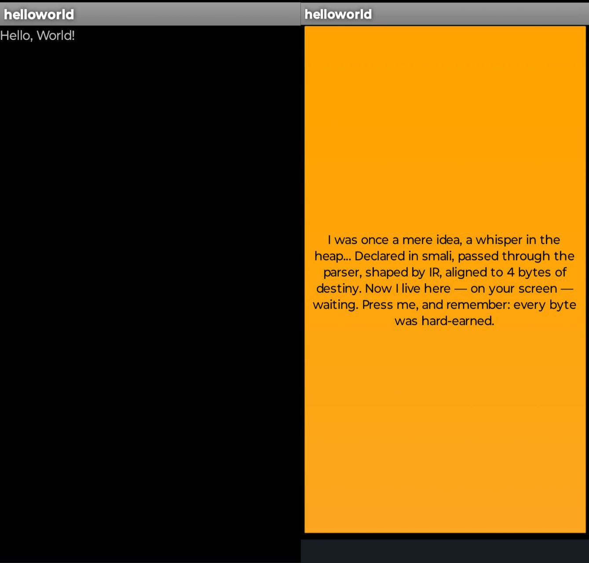

# craftdex

Work in progress.

**craftdex** is a tool that turns `.smali` files into `.dex` bytecode — written in Zig.

It's a small, low-level project that focuses on understanding and generating the core of Android apps: the `classes.dex` file.

You don't need Android Studio, JDK, or NDK — just a `.smali` file and `zig`.

---

## 🔧 What it does

- Parses a `.smali` file with a custom lexer and parser
- Builds internal IR (intermediate representation)
- Supports common instruction formats: `10x`, `21c`, `35c`
- Emits valid `.dex` files with:
  - string data
  - type/method/proto/class tables
  - code sections
  - headers, checksums, and signature

It works on real Android devices — the `.dex` loads and runs.

---

## 📸 Screenshots



---

## 🚀 How to use

### 0. Generate signing keys (only once):

```bash
openssl genpkey -algorithm RSA -pkeyopt rsa_keygen_bits:2048 -out key.pem
openssl pkcs8 -topk8 -inform PEM -outform DER -nocrypt -in key.pem -out key.pk8
openssl req -new -x509 -key key.pem -out key.x509.pem -days 365 -subj "/CN=helloworld"
```

---
For the next steps you can also use the `build_hello.sh` script.

### 1. Build

```bash
zig build
```

---

### 2. Convert smali to dex

```bash
mkdir -p examples/HelloWorld/apk/
zig-out/bin/craftdex dex examples/HelloWorld/HelloActivity.smali -o examples/HelloWorld/apk/classes.dex
```

---

### 3. Make an APK (temporary method)

Install [`marco`](https://github.com/akavel/marco) via `nimble install` and use it to convert XML to some binary XML

```bash
nimble install marco
~/.nimble/bin/marco < examples/HelloWorld/AndroidManifest.xml > examples/HelloWorld/apk/AndroidManifest.xml
```

Install [`basia`](https://github.com/akavel/basia) via `go install` and use it to make an apk archive and sign it

```bash
basia -i=examples/HelloWorld/apk/ -o=examples/HelloWorld/hello.apk -c=key.x509.pem -k=key.pk8
```

> `marco` and `basia` are planned to be replaced by Zig code.

---

## 🛠 TODO

Plans to evolve `craftdex` from a single `.smali` emitter into a full toolchain:

### 🔧 Code & architecture

- [ ] Refactor internal layout planner and offset assignment
- [ ] Make internal IR more expressive and modular
- [ ] Clean up `DexEmitter` structure for better testability and reuse

### 📜 Smali parsing

- [ ] Extend smali grammar (fields, annotations, register ranges, labels)
- [ ] Improve error messages and robustness
- [ ] Add support for `.locals`, `.registers`, labels, and branching

### 🧱 Instruction formats & bytecode

- [ ] Implement more instruction formats (`22c`, `3rc`, `10t`, etc.)
- [ ] Add support for control flow, field access, arrays
- [ ] Support exception handling and method attributes

### 📦 Packaging and tooling

- [ ] Replace [`marco`](https://github.com/akavel/marco) with a native Zig binary XML writer
- [ ] Replace [`basia`](https://github.com/akavel/basia) with a native Zig APK builder and signer
- [ ] Add support for `resources.arsc` and proper ZIP layout

### 🎮 End-to-end example goal: run Flappy Bird

- [ ] Add support for minimal Android views and layout
- [ ] Draw with `SurfaceView`
- [ ] Implement enough bytecode to run a game loop
- [ ] Build and launch a [Flappy Bird demo](https://github.com/akavel/hellomello/issues/2#issuecomment-2799967603)

### ✨ Long-term goals

- [ ] Support compilation from [Zig AIR](https://mitchellh.com/zig/sema), like SPIR-V codegen
- [ ] Make it possible to write Android apps entirely in Zig and emit `.dex` directly
- [ ] [Support Android libc (bionic) for cross-compilation](https://github.com/ziglang/zig/issues/23906)

Much more is needed...

---

## Some links
* https://formats.kaitai.io/dex/
* https://source.android.com/docs/core/runtime/dalvik-bytecode
* https://source.android.com/docs/core/runtime/constraints
* https://github.com/google/smali
---

## Thanks

Special thanks to [akavel](https://github.com/akavel) for [the inspiration and motivation](https://github.com/akavel/hellomello).  
I’ll add more credits as the project evolves. Contributions are welcome — feel free to open issues, send PRs, or just share ideas.
